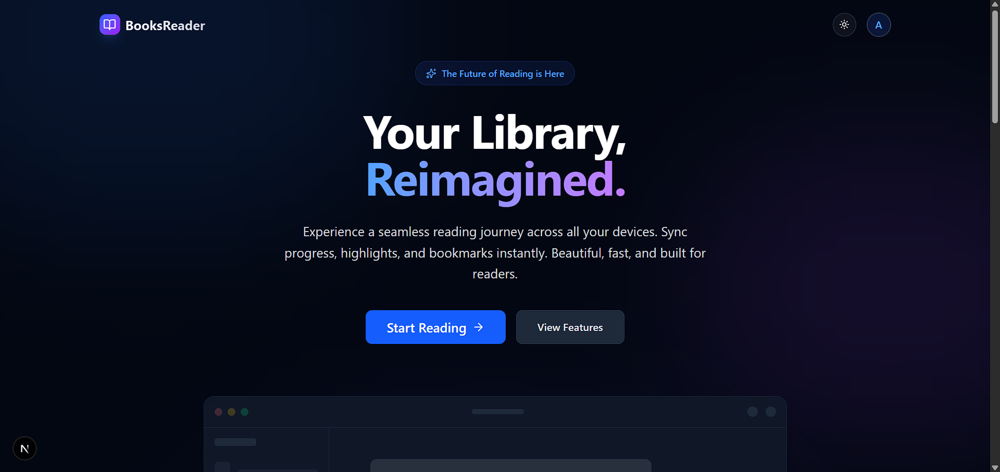
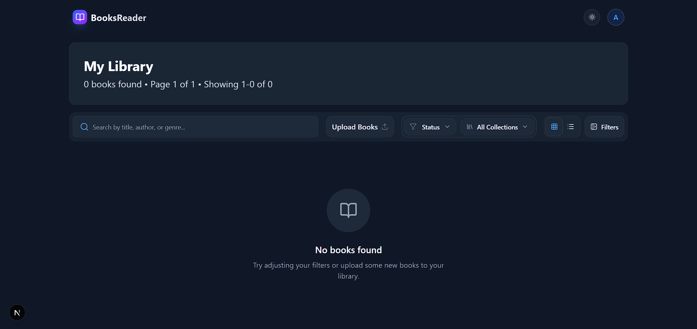
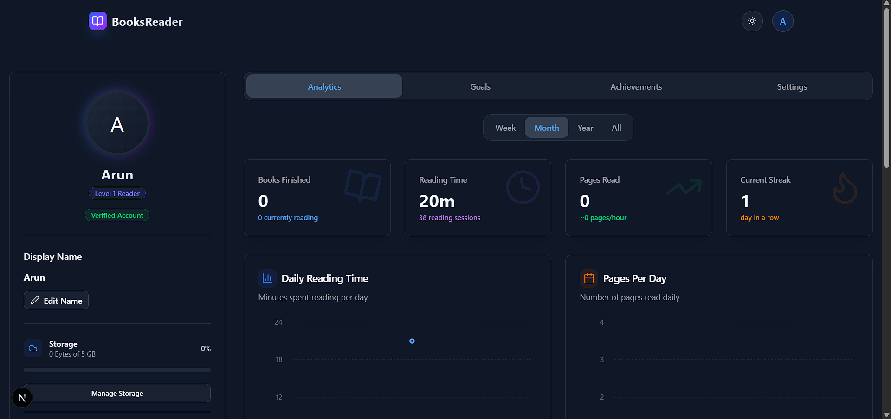

# BooksReader

A full‑stack web app to upload, read, and manage digital books (PDF, EPUB, TXT). The client is a modern Next.js app with Auth0 authentication and rich readers; the server is an Express API using Prisma + PostgreSQL and Backblaze B2 (S3‑compatible) for storage.

# Visuals





---

**What It Does**

- **Upload & import**: Local file upload and URL import with type/size validation.
- **Readers**: PDF (PDF.js) and EPUB (ePub.js) with bookmarks, highlights, search, TTS, progress save.
- **Library**: Metadata, filtering, collections, statuses, analytics.
- **Auth**: Clerk (JWT) protected API; per‑user data isolation.

**Tech Stack**

- **Client**: `Next.js 15`, `React 19`, `TypeScript`, `Tailwind CSS`, `React Query`, Radix UI/ShadCN.
- **Server**: `Express 5`, `Prisma`, `PostgreSQL`, `Backblaze B2 (S3)`, `Clerk`, `Winston`, `Zod`.

---

**Repo Structure**

- `Client/`: Next.js app (readers, library UI, auth integration)
- `Server/`: Express API (uploads, books, bookmarks, highlights, analytics)
- `docker-compose.yml`: Containerized server (client runs separately)
- `API_ENDPOINTS.md`: Full API reference

---

**Quick Start (Local Dev)**

- **Prereqs**: Node.js 18+, PostgreSQL URL, Clerk tenant, Backblaze B2 credentials.
- **Option A — One‑shot script (Windows)**
  - Build the server image once, then run the helper:

```pwsh
# Build backend image (first time)
cd Server
docker build -t booksreader-server:test .

# Run helper to start server (Docker, :5000) and client (:3000)
cd ..
./start-local-dev.ps1
```

- **Option B — Manual (two terminals)**
  - Server (defaults to `PORT=3001`; set to `5000` to match client default):

```pwsh
cd Server
Copy-Item .env.example .env
# Edit .env with Clerk, DATABASE_URL (PostgreSQL), and B2 settings
$env:PORT=5000; npm install; npm start
```

- Client:

```pwsh
cd Client
Copy-Item .env.example .env.local
# Set CLERK_* and NEXT_PUBLIC_API_URL (http://localhost:5000 if using Option A)
npm install
npm run dev
```

- Open: `http://localhost:3000`

---

**Docker Compose (Server only)**

- Prepare `Server/.env.production` from `.env.example` with real values, then:

```pwsh
# From repo root
docker compose up -d --build
```

- Server runs at `http://localhost:5000`; run the client separately in `Client/`.

---

**Setup the project, run, and deploy on your own infrastructure.**
Gether all the prerequisites and environment variables from the `.env.example` files in both `Client/` and `Server/` directories. Follow the guide to run the application locally or use Docker Compose for the server.

For deeper details, see `Client/README.md`, `Server/Readme.md`, and `API_ENDPOINTS.md`.
